# coupon-lab

선착순 쿠폰 발급 시스템 — 동시성 제어 방식을 단계별로 적용하며
부하 테스트로 개선 효과를 검증하는 프로젝트

## 요약

rush 시나리오(재고 100 / 500명 동시 요청) 기준. 괄호 수치는 sustained(지속 부하) 측정값.

| 버전 | 방식 | 초과 발급 | p95 응답시간 | TPS |
|---|---|---|---|---|
| **V0** | 동시성 제어 없음 | **400건 (500/100)** | 2.94s | ~154 |
| **V1** | DB 비관적 락 | **0건** | 1.74s | ~256 (지속 부하 시 ~121) |
| **V2** | Redis 원자 연산 + DB 원자 UPDATE | **0건** | 1.17s | ~367 (지속 부하 시 ~174) |
| **V3** | Kafka 비동기 발급 (Redis 판정 + 배치 기록) | **0건** | 631ms | ~557 (지속 부하 시 ~639) |

각 버전은 이전 버전에서 측정으로 드러난 병목을 제거하는 방향으로 이어진다:
lost update(V0) → 락의 직렬화 한계(V1) → 커넥션 풀 병목(V2) → 응답 경로의 DB 쓰기(V3).

## 기술 스택

Java 17, Spring Boot 4.1.0, Spring Data JPA, MySQL 8.0, Redis 7, Apache Kafka 3.9,
k6, Prometheus, Grafana, Docker Compose

## 실행 방법

````bash
# 인프라 기동 (MySQL, Redis, Kafka, Prometheus, Grafana)
docker compose up -d

# 애플리케이션 실행
./gradlew bootRun
````

- Grafana: http://localhost:3000 (대시보드: `monitoring/dashboard.json` import)
- Prometheus: http://localhost:9090

## API

| 메서드 | 경로 | 설명 |
|---|---|---|
| POST | `/api/coupons` | 쿠폰 생성 (name, totalQuantity) |
| POST | `/api/coupons/{couponId}/issue?userId={userId}` | 쿠폰 발급 |

응답 코드: 발급 성공 `200` / 매진 `409 Conflict` / 존재하지 않는 쿠폰 `404 Not Found`
— 비즈니스 거절을 서버 장애(5xx)와 분리해 Error Rate 지표가 실제 장애만 반영

````bash
# 쿠폰 생성 — 생성된 쿠폰 ID 반환
curl -X POST http://localhost:8080/api/coupons \
  -H "Content-Type: application/json" \
  -d '{"name": "test", "totalQuantity": 100}'

# 쿠폰 발급
curl -X POST "http://localhost:8080/api/coupons/1/issue?userId=1"
````

> 유저/인증 도메인은 범위에서 제외 — `userId`는 검증된 외부 식별자로 가정
> (동시성 제어라는 핵심 문제에 집중하기 위한 의도적 범위 축소)

## 데이터 모델

같은 사건(발급)을 두 방식으로 기록하고, 둘의 일치 여부로 정합성을 검증한다.

| 테이블 | 역할 | 기록 방식 |
|---|---|---|
| `coupon` | 쿠폰 정보 + 발급 집계 | `issued_quantity` 컬럼을 발급마다 증가 |
| `issued_coupon` | 발급 이력 (누가·언제) | 발급마다 행 추가 |

- 매진 판정: `issued_quantity >= total_quantity` (V0/V1) · Redis 카운터 (V2 이후)
- **UPDATE는 동시 요청 시 덮어쓰기(lost update)가 발생할 수 있고, INSERT는 그렇지 않다**

**검증 원칙 — 버전에 따라 판정 주체가 이동한다.** 모든 버전이 답하는 질문은
동일하다: ① 초과 발급이 없는가 ② 유실이 없는가. 이를 확인하는 값이 버전마다 바뀐다.

- **V0 · V1** (MySQL이 판정과 기록을 모두 담당):
  `k6 성공 응답 수 = COUNT(issued_coupon) = coupon.issued_quantity`
- **V2 이후** (Redis가 실시간 판정, MySQL은 기록):
  `k6 성공 응답 수 = COUNT(issued_coupon) = coupon.issued_quantity = Redis 카운트`
- **V3** (비동기 기록): 위 네 값이 **최종적으로** 일치한다. 발급 직후 순간에는
  MySQL 이력이 Redis 카운트보다 적을 수 있고(컨슈머가 처리 중), 잠시 후 수렴한다.

셋째·넷째 값이 바뀌는 것은 이 프로젝트의 핵심 질문 —
**"재고 카운터를 어디서 안전하게 관리하는가"** — 가 버전마다 이동함을 그대로 반영한다.

## 측정 환경 및 방법

````mermaid
flowchart LR
    k6["k6 (Docker)"] -->|HTTP| app["Spring Boot"]
    app -->|Lettuce| redis[("Redis (Docker)")]
    app -->|produce| kafka[["Kafka (Docker)"]]
    kafka -->|consume| app
    app -->|JPA / JDBC| mysql[("MySQL (Docker)")]
    prom["Prometheus (Docker)"] -.->|scrape 5s| app
    prom --> grafana["Grafana (Docker)"]
````

- 로컬 단일 머신, 앱·DB·부하 생성기 동일 호스트
- **절대 성능이 아닌 버전 간 상대 비교 목적** — 동일 조건 고정이 원칙
- HikariCP 커넥션 풀: 기본값 10 / SQL 로그 비활성화 상태에서 측정
- 부하 시나리오 2종 (목적별 분리):
  - **rush** (`k6/issue-coupon.js`): VU 500 × 1회, 재고 100 — 오픈 순간 동시 진입 재현, **정합성 검증** (spike test)
  - **sustained** (`k6/sustained.js`): VU 200 × 30s 반복, 재고 100,000 — 지속 부하에서의 시스템 거동 관측: 처리량 천장, 커넥션 풀 포화 (load test)
- 두 시나리오 모두 k6 `setup()`에서 쿠폰 생성 API를 호출해 시작 상태 고정
  (setup 요청은 부하 통계에서 분리됨)

측정 절차:

````bash
# 1. 초기화 (V2 이후는 Redis도, V3는 Kafka 토픽도 함께 초기화)
docker compose exec mysql mysql -uroot -proot coupon \
  -e "TRUNCATE TABLE issued_coupon; TRUNCATE TABLE coupon;"
docker compose exec redis redis-cli FLUSHALL

# 2. 부하 테스트 (sustained는 /scripts/sustained.js 로 교체)
docker run --rm -i --add-host=host.docker.internal:host-gateway \
  -v ${PWD}/k6:/scripts grafana/k6 run /scripts/issue-coupon.js

# 3. 결과 검증 — 발급 이력 · 집계 · Redis 카운트 대조
docker compose exec mysql mysql -uroot -proot coupon \
  -e "SELECT COUNT(*) AS issued_count FROM issued_coupon WHERE coupon_id = 1;
      SELECT issued_quantity, total_quantity FROM coupon WHERE id = 1;"
docker compose exec redis redis-cli GET coupon:1:count

# (V3) 컨슈머 랙 조회 — 부하 도중 반복 실행하면 처리 지연을 관측할 수 있다
docker compose exec kafka /opt/kafka/bin/kafka-consumer-groups.sh \
  --bootstrap-server localhost:9092 --group coupon-issue-consumer --describe
````

## 개선 여정

### V0 — 동시성 제어 없음 (tag: `v0`)

평범한 `@Transactional` + JPA dirty checking. 단일 스레드에서는 완벽하나,
동시 요청 시 lost update로 **초과 발급 400건**(발급 이력 500 vs 집계 50 불일치)이
발생하는 baseline. race condition을 눈으로 확인하는 출발점.

<details>
<summary><b>측정 결과 · 원인 분석 · 한계 펼쳐보기</b></summary>

**결과**

| 지표 | 값 | 의미 |
|---|---|---|
| 발급 성공 응답 | 500 / 500 | 전원 200 OK — 매진 검증 미작동 |
| 발급 이력 (`issued_coupon` 행 수) | **500건** | 재고(100)의 5배 초과 발급 |
| 발급 집계 (`coupon.issued_quantity`) | **50** | 500회 증가 중 90% 유실 (lost update) |
| 응답 시간 | avg 1.64s / p95 2.94s | 커넥션 풀(10) 대기가 지배적 |
| TPS | ~154 | 500건 / 3.2s |
| 에러율 | 0% | 거절됐어야 할 400건까지 전부 성공 |

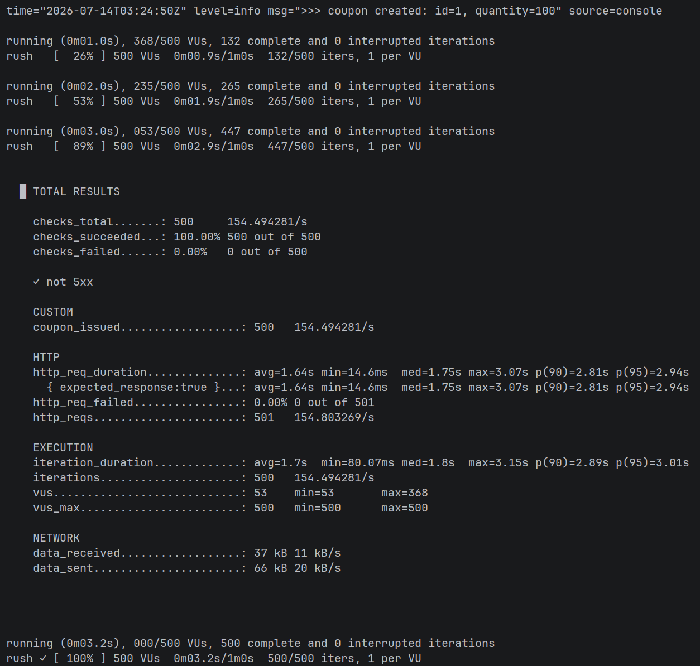

**원인 분석 — lost update**

발급 로직은 `조회(SELECT) → 검증+증가(JVM 메모리) → 저장(커밋 시 UPDATE)`
세 단계로 분리되어 있다. 동시에 진입한 트랜잭션들이 같은 스냅샷을 읽고
서로의 갱신을 덮어쓴다:

````
[Tx A] SELECT → issuedQuantity = 0 읽음
[Tx B] SELECT → issuedQuantity = 0 읽음   ← 같은 값을 읽음
[Tx A] 0 < 100 검증 통과 → 1로 커밋
[Tx B] 0 < 100 검증 통과 → 1로 커밋      ← A의 갱신이 유실됨
````

이로 인해 두 가지가 연쇄적으로 무너진다:

1. **집계 유실**: 500회의 `+1` 중 450회가 덮어쓰기로 증발 (최종값 50)
2. **방어 로직 무력화**: 집계가 100에 도달한 적이 없으므로
   `isSoldOut()`은 한 번도 true가 되지 않음 — 전원 발급 성공

`@Transactional`은 원자성(all-or-nothing)을 보장할 뿐,
MySQL 기본 격리 수준(REPEATABLE READ)에서 read-modify-write 경합을
막아주지 않는다. 격리 수준이 보장하는 것은 "내 트랜잭션 안에서 읽기의
일관성"이지 "내가 읽은 값을 남이 못 바꾸게 하는 것"이 아니기 때문이다.

한편 `issued_coupon`은 INSERT만 발생하므로 유실 없이 500건이 전부 남았다.
**발급 이력(500)과 발급 집계(50)의 불일치** 자체가 race condition의
가장 선명한 증거다.

**한계 기록**

- 부하가 약 3초에 종료되어 5s scrape 간격의 Grafana에는 순간 부하가
  온전히 반영되지 않음 → k6 출력을 1차 자료로 사용
- 초과 발급 "발생" 자체는 안정적으로 재현되나, 구체적 수치(유실률,
  응답시간)는 스레드 스케줄링에 따라 실행마다 달라짐
- 로컬 측정으로 부하 생성기와 서버가 CPU를 공유 — 절대치 해석 불가

</details>

### V1 — DB 비관적 락 (tag: `v1`)

`findById` → `findByIdWithLock` (`@Lock(PESSIMISTIC_WRITE)`, SELECT FOR UPDATE).
읽는 순간 행을 잠가 "조회→검증→갱신"을 독점 구간으로 만든다. 초과 발급 0건으로
정합성은 완전하나, 처리량이 단일 행 락의 직렬 처리 속도(TPS ~121)에 묶인다.

<details>
<summary><b>측정 결과 · 원인 분석 · 한계 펼쳐보기</b></summary>

**측정 1 — rush (재고 100 / 500명 × 1회): 정합성 검증**

| 지표 | V0 | V1 |
|---|---|---|
| 초과 발급 | 400건 | **0건** |
| 발급 이력 vs 집계 | 500 vs 50 (불일치) | **100 = 100 (일치)** |
| p95 | 2.94s | **1.74s (개선)** |
| TPS | ~154 | ~256 |

**예측과 결과가 달랐다**: 직렬화로 성능 악화를 예상했으나 오히려 개선.
원인 — ① 커넥션 풀(10)이 이미 동시성을 제한해 V0도 사실상 직렬이었고
② 매진 후 400건이 예외로 조기 종료되어(INSERT/UPDATE 없이 락 즉시 반납)
총 작업량 자체가 감소. "락 = 느려짐"은 경합 형태와 실패 경로 비용에 따라
성립하지 않을 수 있다.

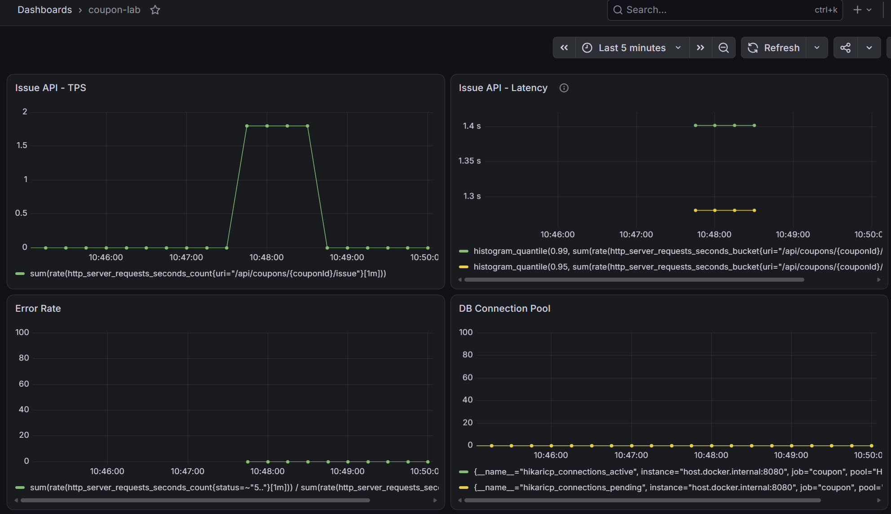

**측정 2 — sustained (재고 10만 / 200 VU × 30s): 부하 특성 관측**

조기 종료 효과를 제거하고(전 요청이 검증→INSERT→UPDATE 전 과정을 수행)
락의 직렬화 비용을 직접 측정.

| 지표 | 값 |
|---|---|
| 처리량 천장 | **TPS ~121** |
| p95 / max | 1.78s / 1.99s |
| 정합성 | **3,848 = 3,848 = 3,848** (k6 성공 응답 = 발급 이력 = 발급 집계) — 대량 경합에서 유실 0건 |
| 커넥션 풀 | **active 10 고정, pending ~190** (아래 그래프) |
| timeout | 미발생 (200 VU 기준: pending이 30s 한도 내 소화됨) |

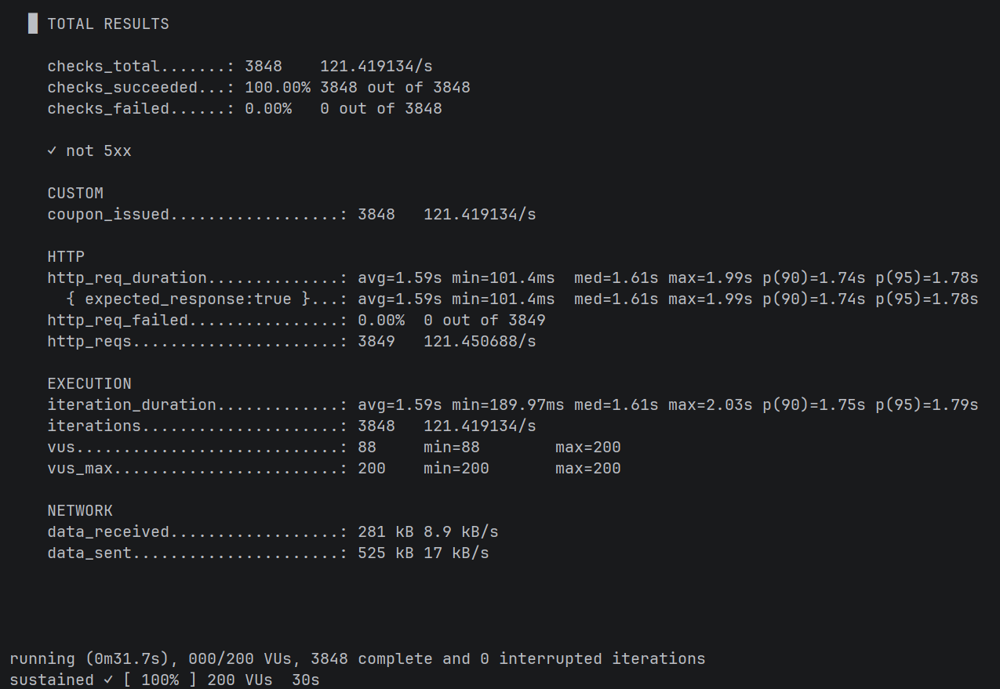
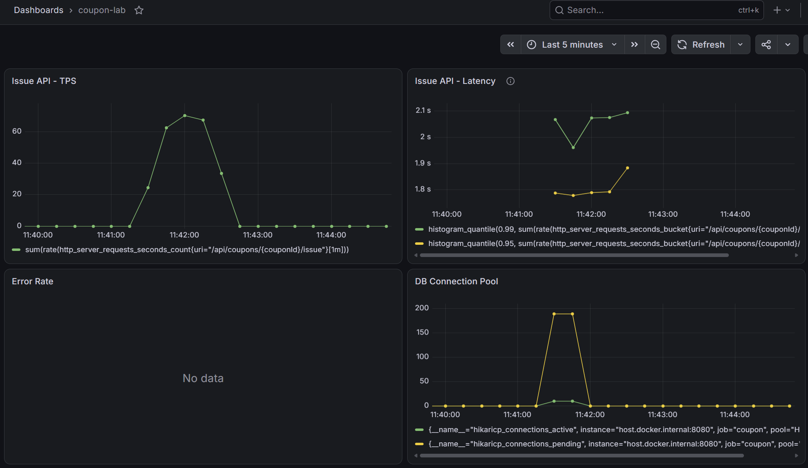

커넥션 10개 전부가 락 대기에 묶이고 190개 요청이 풀 앞에 대기하는
정상 상태(steady state). med(1.61s)와 p95(1.78s)가 근접 — 락 줄서기에서는
대기 시간이 확률이 아니라 대기열 길이로 결정되므로 "모두가 균등하게 느린"
분포가 나타난다.

**V1의 결론과 한계**: 정합성은 완전하나, 처리량이 단일 행 락의 직렬 처리
속도에 종속된다. 부하가 커질수록(VU 증가) 대기열만 길어지고 처리량은
~121에서 불변 — 서버를 늘려도 병목(DB의 한 행)이 그대로이므로 수평 확장이
불가능한 구조. → V2에서 재고 판정을 DB 밖(Redis 원자 연산)으로 분리.

</details>

### V2 — Redis 원자 연산 + DB 원자 UPDATE (tag: `v2`)

V1의 병목은 재고 판정을 위한 단일 행 락이었다. **판정을 DB 밖으로 분리**하고,
DB에는 락 없이 기록만 남긴다. 두 축 모두 원자 연산으로 처리해 락을 완전히 제거했다.

- **판정 (Redis Lua)**: `GET → 한도 비교 → INCR`을 스크립트 하나로 원자 실행.
  Redis 싱글 스레드가 스크립트 전체의 원자성을 보장하므로, "읽고-검증-증가"
  사이에 다른 요청이 끼어들 수 없다. 락 없이 정확히 재고만큼만 통과된다.
- **기록 (DB 원자 UPDATE)**: 통과한 요청만 `issued_coupon` INSERT +
  `SET issued_quantity = issued_quantity + 1`로 집계 갱신. 값을 읽어와 계산 후
  쓰는 것이 아니라 증가 연산 자체를 DB에 위임하므로, V0의 lost update가 발생하지 않는다.
  판정은 이미 Redis가 끝냈으므로 UPDATE에 한도 조건(`WHERE ... < total`)이 불필요 —
  MySQL은 판정에서 해방되어 순수 기록만 수행한다.

결과는 rush · sustained 양쪽에서 V1을 앞서며(p95·TPS 모두 개선), 정합성도 완전하다.

<details>
<summary><b>측정 결과 · 원인 분석 · 한계 펼쳐보기</b></summary>

**측정 1 — rush (재고 100 / 500명 × 1회): 정합성 검증**

| 지표 | V1 | V2 |
|---|---|---|
| 초과 발급 | 0건 | **0건** |
| 정합성 (이력 = 집계 = Redis) | 100 = 100 | **100 = 100 = 100 (일치)** |
| p95 | 1.74s | **1.17s (33% 개선)** |
| TPS | ~256 | **~367 (43% 향상)** |

거절된 400건은 Redis에서 즉시 반려되어 MySQL에 진입하지 않는다. 승자 100건만
DB 작업을 수행하므로, 락 대기 구간이 사라진 만큼 응답시간과 처리량이 함께 개선됐다.

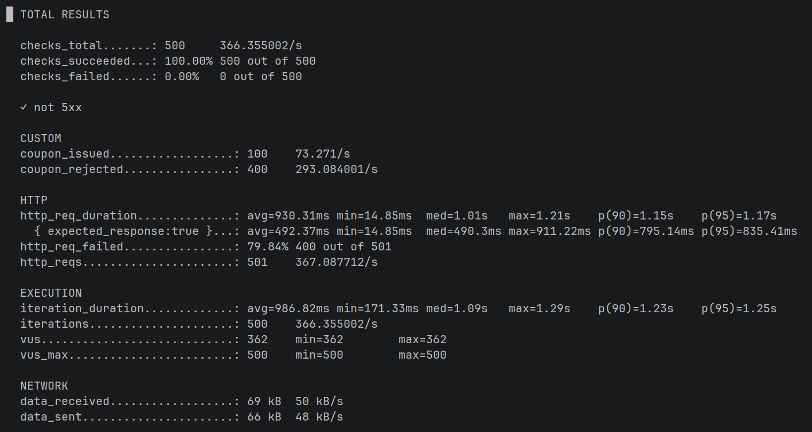
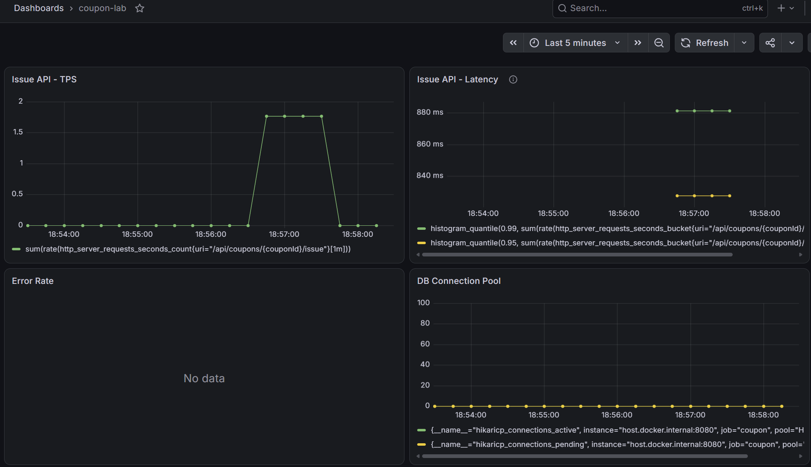

**측정 2 — sustained (재고 10만 / 200 VU × 30s): 부하 특성 관측**

전 요청이 끝까지 발급을 완주하는 시나리오. 조기 종료 효과 없이 순수한
처리량 천장을 측정한다.

| 지표 | V1 | V2 |
|---|---|---|
| 처리량 천장 (TPS) | ~121 | **~174 (44% 향상)** |
| p95 | 1.78s | **1.20s** |
| 정합성 | 3,848 = 3,848 = 3,848 | **5,412 = 5,412 = 5,412 = 5,412** |
| 커넥션 풀 | active 10 / pending ~190 | active 10 / **pending ~190** |

5,412건의 동시 원자 UPDATE에서 유실 0건 — V0에서 500건 중 450건이 증발했던
lost update가, 원자 연산에서는 대량 부하에서도 발생하지 않음을 확인했다.

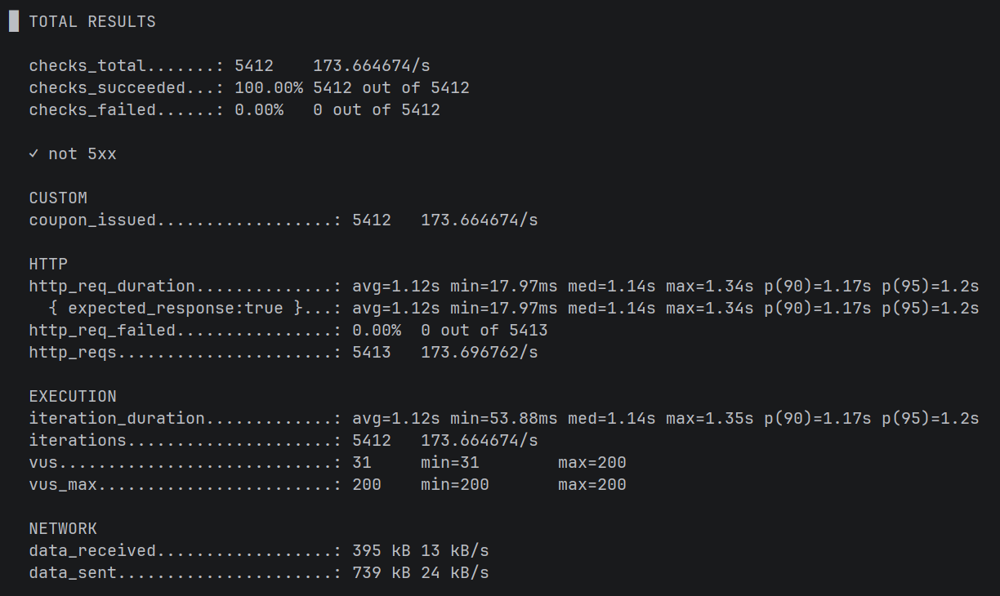
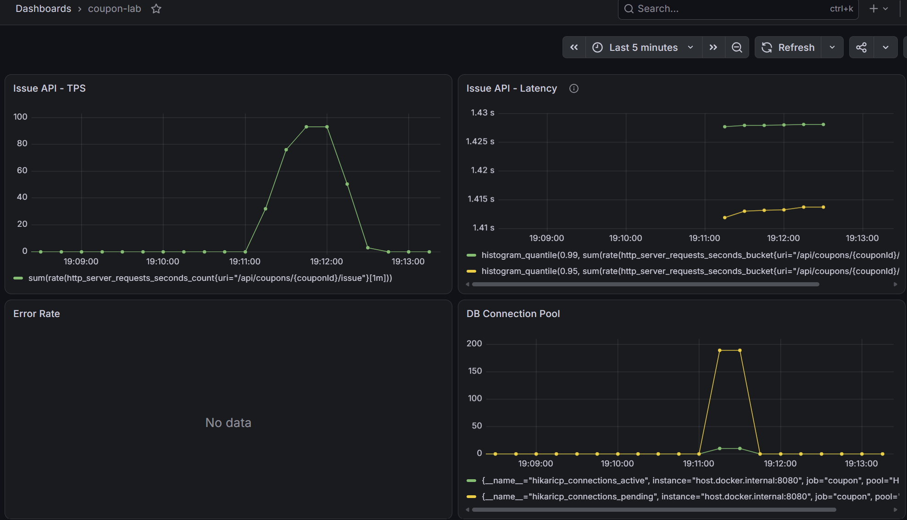

**V2의 결론과 한계**: 락을 제거해 커넥션 회전 속도가 빨라졌고(TPS 121→174),
정합성은 완전하다. 그러나 **커넥션 풀 대기(pending ~190)는 V1과 동일하게 남았다.**
요청이 커넥션을 잡고 `Redis 왕복 → INSERT → UPDATE`를 마칠 때까지 그 커넥션을
점유하므로, 200 VU가 몰리면 커넥션 10개 앞에 190개가 줄 서는 구조 자체는
변하지 않는다. 락은 병목이 아니게 됐지만, **MySQL 쓰기가 응답 경로에 남아 있는 한
커넥션 풀이라는 상한은 넘을 수 없다.** → V3에서 발급 이벤트를 비동기로 분리(Kafka)해,
응답 경로에서 DB 쓰기를 제거한다.

</details>

### V3 — Kafka 비동기 발급 (tag: `v3`)

V2가 남긴 병목은 커넥션 풀이었다. 락은 없앴지만, 발급 요청이 커넥션을 잡고
`INSERT + UPDATE`를 마칠 때까지 점유하므로 200 VU가 몰리면 커넥션 10개 앞에
190개가 대기했다(pending ~190). **DB 쓰기를 응답 경로에서 제거**해 이 벽을 넘는다.

- **응답 경로**: 요청 → Redis Lua 판정 → Kafka produce(`acks=all`, 저장 확인) → 즉시 응답.
  MySQL을 전혀 건드리지 않는다. (totalQuantity도 Redis에서 읽도록 이전 완료)
- **비동기 경로**: 컨슈머가 `coupon-issued` 토픽을 배치로 소비 →
  다중 VALUES 단일 INSERT + 집계 일괄 UPDATE(+N). 발급 시각은 프로듀서에서 확정해
  컨슈머 지연과 무관하게 기록된다.
- **멱등성**: Kafka는 at-least-once라 중복 수신이 가능하다.
  `issued_coupon (coupon_id, user_id)` 유니크 제약 + `INSERT IGNORE`로,
  같은 이벤트를 두 번 처리해도 결과가 동일하도록 보장한다.

응답과 영속화가 분리되므로 검증은 **최종 일관성(eventual consistency)** 기준으로 본다:
발급 직후 순간에는 MySQL 이력이 Redis 카운트보다 적을 수 있고(컨슈머가 처리 중),
잠시 후 수렴해 일치한다.

<details>
<summary><b>측정 결과 · 원인 분석 · 한계 펼쳐보기</b></summary>

**측정 1 — rush (재고 100 / 500명 × 1회): 정합성 검증**

| 지표 | V2 | V3 |
|---|---|---|
| 초과 발급 | 0건 | **0건** |
| 정합성 | 100 = 100 = 100 | **100 = 100 = 100** |
| p95 | 1.17s | **631ms (46% 개선)** |
| TPS | ~367 | **~557 (52% 향상)** |
| DB pending | ~190 | **0** |

성공 응답만 보면 p95 555ms — 이는 순수하게 Redis 판정 + Kafka produce 시간이며,
V2에서 응답 경로에 있던 INSERT/UPDATE 왕복이 사라진 만큼 줄었다. pending이 0인 것은
발급 API가 DB 커넥션을 전혀 사용하지 않음을 보여준다.

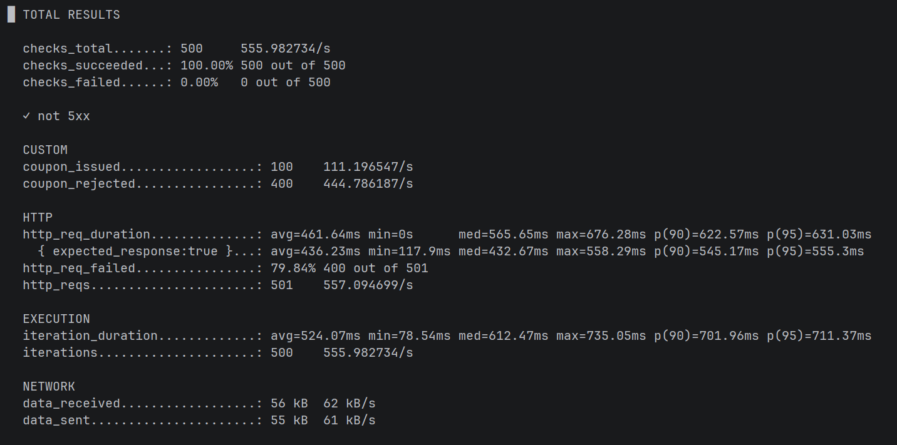
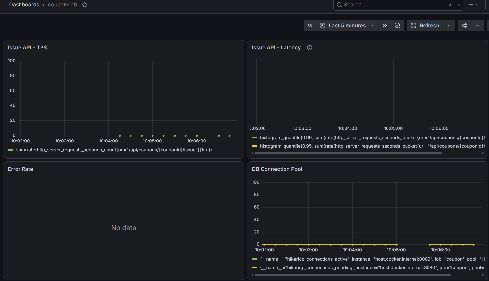

**측정 2 — sustained (재고 10만 / 200 VU × 30s): 부하 특성 관측**

| 지표 | V1 | V2 | V3 |
|---|---|---|---|
| 처리량 천장 (TPS) | ~121 | ~174 | **~639** |
| p95 | 1.78s | 1.20s | **335ms** |
| 30초간 총 발급 | 3,848 | 5,412 | **19,444** |
| 정합성 | 3,848 일치 | 5,412 일치 | **19,444 = 19,444 = 19,444** |

지속 부하에서 격차가 가장 크게 벌어진다(TPS V2 대비 3.7배). V2까지는 발급 요청마다
커넥션을 잡고 DB 작업을 하는 구조라 200 VU가 커넥션 10개를 두고 경합했으나,
V3는 발급 경로에서 DB를 제거해 이 경합 자체가 사라졌다. 응답이 빨라진 만큼
같은 200 VU가 더 많은 요청을 밀어넣어 처리량 천장이 함께 올랐다.

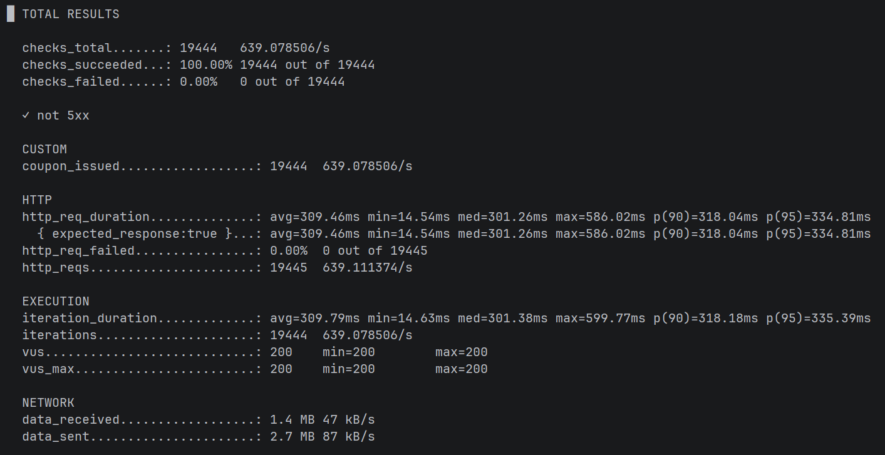
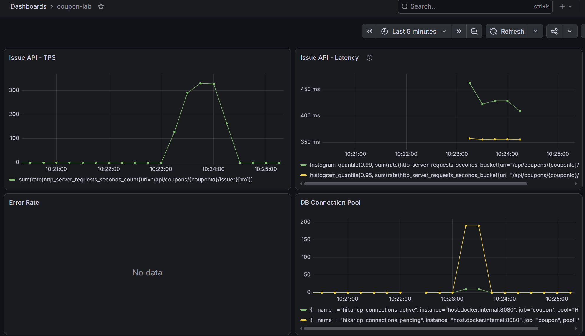

**컨슈머 랙 — 최종 일관성의 정량 관측**

부하 도중 컨슈머 그룹의 LAG(쌓였으나 미처리된 메시지 수)를 반복 조회:

| 쌓임(LOG-END) | 처리(CURRENT) | LAG |
|---|---|---|
| 1,832 | 1,405 | 427 |
| 4,904 | 4,347 | 557 |
| 7,136 | 6,650 | 486 |
| 9,756 | 9,209 | 547 |
| 12,021 | 11,536 | 485 |
| 14,091 | 13,593 | 498 |

LAG가 증가하지 않고 **500 안팎에서 안정적으로 유지**된다 — 컨슈머가 초당 ~639건의
생산 속도를 실시간으로 따라잡으며 약 500건의 버퍼만 남긴다는 뜻이다. 이 버퍼가
곧 "응답과 영속화의 시차"이며, 부하 종료 후 컨슈머가 잔여분을 소화하면 0으로 수렴한다.
(부하 종료 후 조회 시점에는 이미 19,444로 일치)

**V3의 결론과 한계**: 응답 경로에서 DB를 제거해 rush·sustained 모두에서 최고 성능에
도달했고(sustained TPS V2 대비 3.7배), 커넥션 풀 병목을 벗어났다. 병목은 이제
발급 API가 아니라 컨슈머의 배치 처리 쪽으로 이동했으며, 이는 응답 경로 밖이라
유저 응답 시간에 영향을 주지 않는다.

다만 새로운 트레이드오프가 생긴다:
- **응답 ≠ 영속화**: 유저는 "발급 성공"을 받았으나 그 순간 MySQL에는 아직 없을 수 있다.
  발급 직후 이력 조회 UI가 필요하면 Redis를 조회하거나 "처리 중" 상태를 노출해야 한다.
- **Redis-Kafka 부분 실패**: Redis INCR 성공 후 Kafka produce가 실패하면 카운터만
  올라간 상태가 된다. 현재는 예외를 던져 유저에게 실패를 알리는 선까지만 처리한다.
- **인프라 축소**: 브로커 1대 / RF 1 / 볼륨 미적용 — 단일 머신 측정 환경의 제약.
  브로커 장애 시 미소비 이벤트 유실 가능. 실무는 브로커 3대 이상 + RF 3 +
  min.insync.replicas 2로 구성한다.

**구현 노트**: 컨슈머의 대량 삽입은 JdbcTemplate 사용. `IssuedCoupon`의 ID 전략이
IDENTITY라 Hibernate가 JDBC 배치를 적용할 수 없고(ID 확보를 위해 건별 INSERT 필요),
멱등성에 필요한 `INSERT IGNORE`가 JPQL로 표현되지 않기 때문. 발급 API 등 일반 경로는
기존대로 JPA를 유지한다.

</details>

## 검토했으나 채택하지 않은 방식

- **낙관적 락**: 선착순은 충돌률이 사실상 100%인 도메인이라, 재시도 비용이
  락 대기 비용보다 커질 것으로 판단(재시도 폭풍). 충돌이 드문 환경에 적합한 기법.
- **분산 락(Redisson 등)**: Redis를 락 메커니즘으로만 사용하는 방식.
  본 프로젝트는 "재고 확인+증가"라는 단순 로직이라, 락으로 감싸는 대신
  Lua 스크립트로 로직 자체를 원자화하는 상위 호환 방식을 채택. 중복 발급 방지 등
  복잡한 로직이 필요했다면 분산 락이 더 적합했을 것 —
  본 프로젝트는 범위를 좁혀 이 필요성 자체를 제거함.
- **Redis Sorted Set**: 발급 순서·순위가 중요한 대기열(waiting queue)에 적합.
  본 프로젝트는 "한도 내인가"만 판정하면 되므로 단순 카운터(INCR)로 충분.
  대규모 동시 입장 제어로 확장한다면 고려 대상.