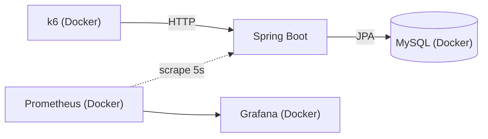

# coupon-lab

선착순 쿠폰 발급 시스템 — 동시성 제어 방식을 단계별로 적용하며
부하 테스트로 개선 효과를 검증하는 프로젝트

## 요약

재고 100개 쿠폰에 500명이 동시 발급을 요청하는 시나리오 기준:

| 버전 | 방식 | 초과 발급 | p95 응답시간 | TPS |
|---|---|---|---|---|
| **V0** | 동시성 제어 없음 | **400건 (500/100)** | 2.94s | ~154 |
| V1 | DB 비관적 락 | (진행 예정) | | |
| V2 | Redis 원자 연산 | (진행 예정) | | |
| V3 | Kafka 비동기 발급 | (진행 예정) | | |

## 기술 스택

Java 17, Spring Boot 4.1.0, Spring Data JPA, MySQL 8.0,
k6, Prometheus, Grafana, Docker Compose

## 실행 방법

```bash
# 인프라 기동 (MySQL, Prometheus, Grafana)
docker compose up -d

# 애플리케이션 실행
./gradlew bootRun
```

- Grafana: http://localhost:3000 (대시보드: `monitoring/dashboard.json` import)
- Prometheus: http://localhost:9090

## API

| 메서드 | 경로 | 설명 |
|---|---|---|
| POST | `/api/coupons` | 쿠폰 생성 (name, totalQuantity) |
| POST | `/api/coupons/{couponId}/issue?userId={userId}` | 쿠폰 발급 |

```bash
# 쿠폰 생성 — 생성된 쿠폰 ID 반환
curl -X POST http://localhost:8080/api/coupons \
  -H "Content-Type: application/json" \
  -d '{"name": "test", "totalQuantity": 100}'

# 쿠폰 발급
curl -X POST "http://localhost:8080/api/coupons/1/issue?userId=1"
```

> 유저/인증 도메인은 범위에서 제외 — `userId`는 검증된 외부 식별자로 가정
> (동시성 제어라는 핵심 문제에 집중하기 위한 의도적 범위 축소)

## 측정 환경 및 방법



- 로컬 단일 머신, 앱·DB·부하 생성기 동일 호스트
- **절대 성능이 아닌 버전 간 상대 비교 목적** — 동일 조건 고정이 원칙
- HikariCP 커넥션 풀: 기본값 10 / SQL 로그 비활성화 상태에서 측정
- 부하 시나리오: k6 `per-vu-iterations`, VU 500 × 1회
  (500명이 각자 다른 userId로 동시에 1회씩 요청 — 선착순 오픈 상황 재현)
- k6 `setup()`에서 매 실행마다 신규 쿠폰(재고 100)을 생성하여 시작 상태 고정

측정 절차:

```bash
# 1. 초기화 (테이블 및 auto_increment 리셋)
docker compose exec mysql mysql -uroot -proot coupon \
  -e "TRUNCATE TABLE issued_coupon; TRUNCATE TABLE coupon;"

# 2. 부하 테스트
docker run --rm -i --add-host=host.docker.internal:host-gateway \
  -v ${PWD}/k6:/scripts grafana/k6 run /scripts/issue-coupon.js

# 3. 결과 검증
docker compose exec mysql mysql -uroot -proot coupon \
  -e "SELECT COUNT(*) AS issued_count FROM issued_coupon WHERE coupon_id = 1;
      SELECT issued_quantity, total_quantity FROM coupon WHERE id = 1;"
```

## 개선 여정

### V0 — 동시성 제어 없음 (tag: `v0`)

평범한 `@Transactional` + JPA dirty checking 구현. 단일 스레드에서는
완벽하게 동작하지만, 동시 요청에서 어떤 일이 벌어지는지 측정한 baseline.

**결과**

| 지표 | 값 | 의미 |
|---|---|---|
| 발급 성공 응답 | 500 / 500 | 전원 200 OK — 매진 검증 미작동 |
| 발급 이력 수 (`issued_coupon`) | **500건** | 재고(100)의 5배 초과 발급 |
| 쿠폰 카운터 (`issued_quantity`) | **50** | 500회 증가 중 90% 유실 (lost update) |
| 응답 시간 | avg 1.64s / p95 2.94s | 커넥션 풀(10) 대기가 지배적 |
| TPS | ~154 | 500건 / 3.2s |
| 에러율 | 0% | 거절됐어야 할 400건까지 전부 성공 |


**원인 분석 — lost update**

발급 로직은 `조회(SELECT) → 검증+증가(JVM 메모리) → 저장(커밋 시 UPDATE)`
세 단계로 분리되어 있다. 동시에 진입한 트랜잭션들이 같은 스냅샷을 읽고
서로의 갱신을 덮어쓴다:

```
[Tx A] SELECT → issuedQuantity = 0 읽음
[Tx B] SELECT → issuedQuantity = 0 읽음   ← 같은 값을 읽음
[Tx A] 0 < 100 검증 통과 → 1로 커밋
[Tx B] 0 < 100 검증 통과 → 1로 커밋      ← A의 갱신이 유실됨
```

이로 인해 두 가지가 연쇄적으로 무너진다:

1. **카운터 유실**: 500회의 `+1` 중 450회가 덮어쓰기로 증발 (최종값 50)
2. **방어 로직 무력화**: 카운터가 100에 도달한 적이 없으므로
   `isSoldOut()`은 한 번도 true가 되지 않음 — 전원 발급 성공

`@Transactional`은 원자성(all-or-nothing)을 보장할 뿐,
MySQL 기본 격리 수준(REPEATABLE READ)에서 read-modify-write 경합을
막아주지 않는다. 격리 수준이 보장하는 것은 "내 트랜잭션 안에서 읽기의
일관성"이지 "내가 읽은 값을 남이 못 바꾸게 하는 것"이 아니기 때문이다.

한편 `issued_coupon`은 INSERT만 발생하므로 유실 없이 500건이 전부 남았다.
**발급 이력(500)과 카운터(50)의 불일치** 자체가 race condition의
가장 선명한 증거다.

**한계 기록**

- 부하가 약 3초에 종료되어 5s scrape 간격의 Grafana에는 순간 부하가
  온전히 반영되지 않음 → k6 출력을 1차 자료로 사용
- 초과 발급 "발생" 자체는 안정적으로 재현되나, 구체적 수치(유실률,
  응답시간)는 스레드 스케줄링에 따라 실행마다 달라짐
- 로컬 측정으로 부하 생성기와 서버가 CPU를 공유 — 절대치 해석 불가